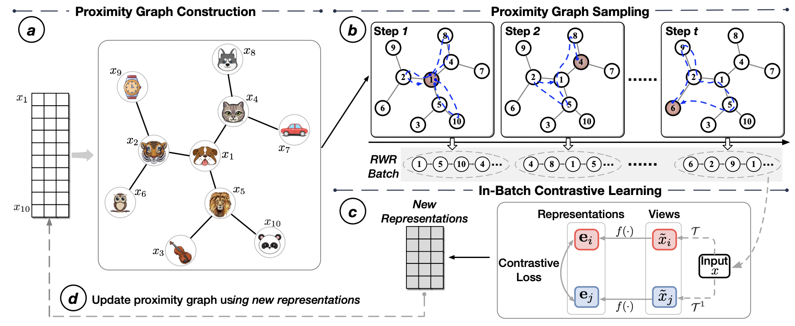

<p>
  
  <br />
</p>

<hr>

<h1> BatchSampler: Sampling Mini-Batches for Contrastive Learning in Vision, Language, and Graphs </h1>


# BatchSampler
The source code for BatchSampler that accepted in KDD'23
# Citing
If you find our work is helpful to your research, please consider citing our paper:

```
@article{yang2023batchsampler,
  title={BatchSampler: Sampling Mini-Batches for Contrastive Learning in Vision, Language, and Graphs},
  author={Yang, Zhen and Huang, Tinglin and Ding, Ming and Dong, Yuxiao and Ying, Rex and Cen, Yukuo and Geng, Yangliao and Tang, Jie},
  journal={arXiv preprint arXiv:2306.03355},
  year={2023}
}
```
